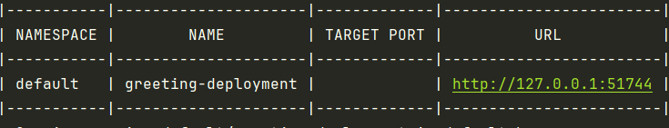
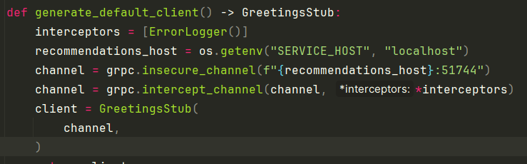
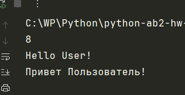

- [X] **1. Установка и настройка (1 балл):**

  - Настроен файл `pyproject.toml` для удобной установки зависимостей проекта
  - Добавлен `style_check` в СI 
  - Сформирована файловая структура проекта

- [X] **2. Создание простого gRPC сервиса с одним методом (1 балл):**
  ### Вопрос: PyCharm не видит сущностей из service_pb2 хотя при исполнении всё работает.
  - Создал команду в make для генерации стабов
  - начал с написания клиента
  - после чего написал сервер и запустил, после чего запустил клиент, который вернул что и требовалось

- [X] **3. Добавление второго метода в сервис (1 балл):**

  - Добавил в протофайл новые типы
  - Дописал функционал в файле `sevice`
  - Так как не очень понял что имеется в виду под словом клиент написал свою прослойку для базового клиента.(так же сделал это чтобы ide показывала подсказки по типам)
  
- [X] **4. Обработка ошибок (1 балл):**
  - Я не понял как можно обработать ошибку инвалидности данных руками, если при создании объекта запроса есть проверка типов, поэтому придумаю своё ограничение. Пусть привет можно передавать всем кроме имени "Danila"
  - Так же добавил в свой класс клиента try statement для обработки ошибки

- [X] **5. Логирование (1 балл):**

  - Добавим в зависимости grpc-interceptor
  - Написал свой интерцептор выводящий в консоль лог ошибки для сервиса и такой же для клиента

- [X] **6. Тестирование (1 балл):**

  - Написал тесты и создал test в docker-compose который запускает сервис и тестовый контейнер а потом и сами тесты

- [X] **7. Контейнеризация сервиса с использованием Docker (2 балла):**

  - Создал контейнер для запуска сервиса и клиента
  - Создал docker-compose, где описал запуск service и client при запуске клиента подтягивается и сервис после чего клиент делает тестовый запуск
  - Так же можно запустить файл и с локальной машины получив такой-же ответ от сервера

- [X] **8. Развёртывание сервиса на Kubernetes (k8s) (2 балла):**
  - ### Создание кластера Kubernetes с помощью Minikube
    #### После установки minikube, kind и kubectl создал кластер с помощью команды
    ```sh
    minikube start
    ```
  - после чего используем переменные окружения куба чтобы не выгружать контейнер а взять его с локалки
  - создаём развёртывание и серис командой
    ```sh
    kubectl apply -f ./deployment.yaml
    ```
    ```sh
    kubectl expose deployment greeting-deployment --type=LoadBalancer --port=5000
    minikube service greeting-deployment
    ```
  - После чего получим порт на локальной машине на котором открыто соединение и вставим его в код клиента
  
  
  
  
[Вернуться][main]

[main]: ../../README.md "содержание"
